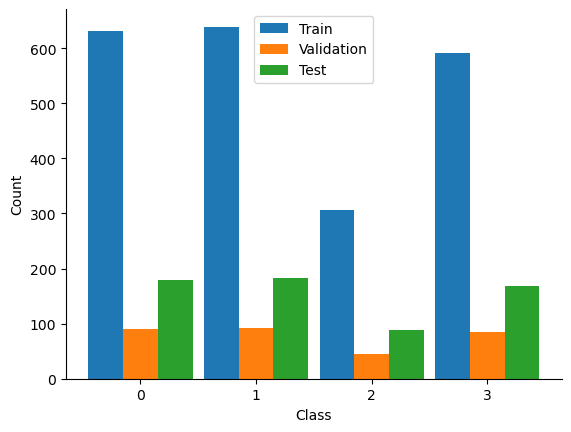
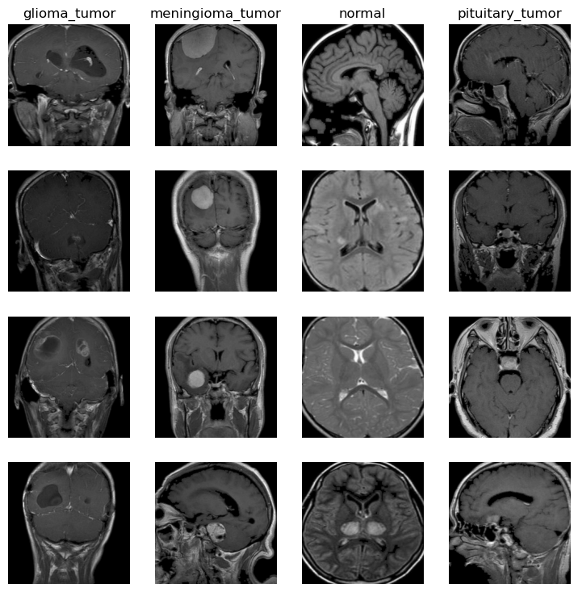
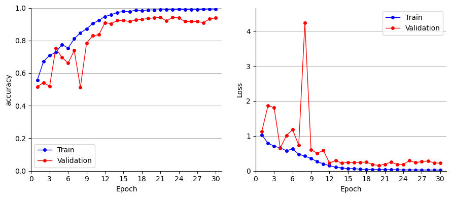
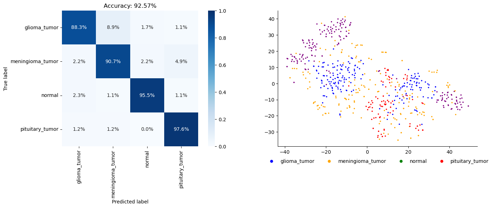
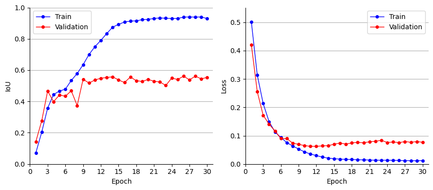
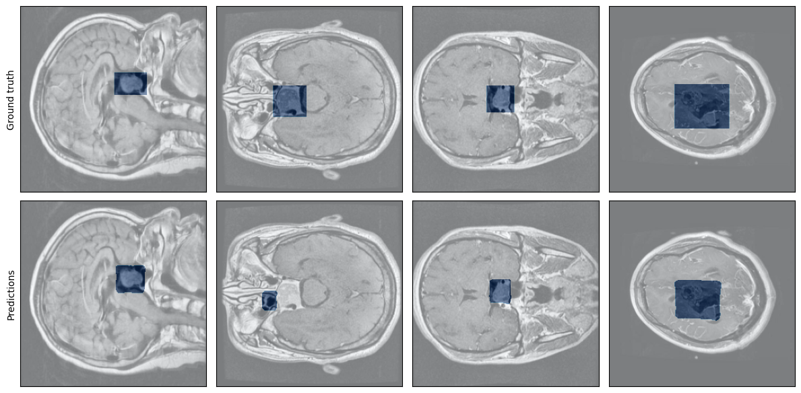

# Brain Tumor Classification and Segmentation

Codes and experiments for the DS5220 course:
Pooria daneshvar Kakhaki and Neda Ghohabi Esfahani

Contact:  
**Pooria daneshvar Kakhaki**  
Email: [daneshvarkakhaki.p@northeastern.edu](mailto:daneshvarkakhaki.p@northeastern.edu)  
**Neda Ghohabi Esfahani**  
Email: [ghohabiesfahani.n@northeastern.edu](mailto:ghohabiesfahani.n@northeastern.edu)


## Introduction: 
Brain tumors are among the most aggressive diseases, with over 84,000 individuals expected to receive a primary brain tumor diagnosis in 2021 and approximately 18,600 estimated to lose their lives to malignant brain tumors (brain cancer) during the same year [8]. Magnetic Resonance Imaging (MRI) remains the most effective method for detecting brain tumors. Unlike other cancers, brain tumors often result in profound and lasting physical, cognitive, and psychological effects on patients. Therefore, early diagnosis and the development of optimal treatment plans are crucial to improving both life expectancy and quality of life for these individuals. Neural networks have demonstrated remarkable accuracy in image classification and segmentation tasks, making them highly valuable in advancing brain tumor detection and analysis.


## Motivations:
Importance and Potential Impact of the Project
- MRI is currently the gold standard for detecting brain tumors, generating large volumes of image data for analysis.
- Effective treatment relies on precise diagnosis and classification, which can significantly impact patient survival rates and quality of life.
- Radiologists manually examine these MRI images, a process prone to errors given the complexities and subtle differences in tumor characteristics.


## Dataset

### Classification

The dataset for tumor classification can be accessed from [Kaggle](https://www.kaggle.com/datasets/thomasdubail/brain-tumors-256x256).
This dataset is designed for advanced medical research, containing MRI images across four classes: 

- Pituitary: Abnormal growth of cells in the pituitary gland
- Glioma: Tumor that originates in the brain or spinal cord from glial cells
- Meningioma: Tumor that grows in the meninges
- Normal: No tumor
  
The data distribution is as follows:




Some samples of each class:



### Segmentation

- The dataset for tumor segmentation can be accessed from [Kaggle](https://www.kaggle.com/datasets/pkdarabi/brain-tumor-image-dataset-semantic-segmentation).

## Environment

Prepare the virtual environment:

You can use the provided YAML file to create the environemt:
```shell
conda env create -f environment.yml
conda activate infant_denoising
```

Download the datasets and put them in the following structure:

```
- Data/
    - Classification/
        - glioma_tumor\
        - meningioma_tumor\
        - normal\
        - pituitary_tumor\
    - Segmentation/
        - test\
        - train\
        -valid\
        -README.txt
```

## Methodology

### Models

We used our models based on their proven effectiveness in image classification tasks, particularly in the medical field. For example for segmentation, we started with different implementation of UNet which is proved to be effective in different task of medical segmentation.

- **Tumor Classification**: For tumor classification, we have used a range of different models, from different vesion of ResNet and Vision Transformers. Since we noticed no advantage in using more complex models, we settled on a smaller residual convolutional network and trained it from scratch.
- **Tumor Segmentation**: We used Pixel-Wise classification models such as Unet ans Mask-RCNN. We first used our classification netwok as the UNet's encoder and build the decoder based on that. However, we noticed that the model was not able to converge on the segmentation dataset. Our final model utilized ResNet50, loaded with weights from training on imagenet.

### Hyperparameters

We compiled ou models using different optimizers (SGD, RMSprop, Adam, ADOPT) and various learnign rate schedulers. We noticed that Adam and ADOPT performed best paired with our models. For scheduliong the learning rate, we used a linear warmup for 25% of the training, then gradually decrease the learning rate during the end of the training. Our base learning rate is 0.001.

### Setup:
The Models were trained and tested on a GPU enabled environmen t in Kaggle, ensuring efficient handling of the computationally intensive tasks.


## Results and Conclusion:
- Classification performance: We were able to achieve about 92.% accuracy.





- Segmentation performance: We were able to achieve an IoU of 0.5





## How to use:
- Download the dataset from the provided link.
- clone this repository
- Run the classification and segmentation notebook.

Python scripts will be added in the future to enable runnig the scipts in the command line environment.

## References:

https://github.com/SartajBhuvaji/Brain-Tumor-Classification-Using-Deep-Learning-Algorithms

